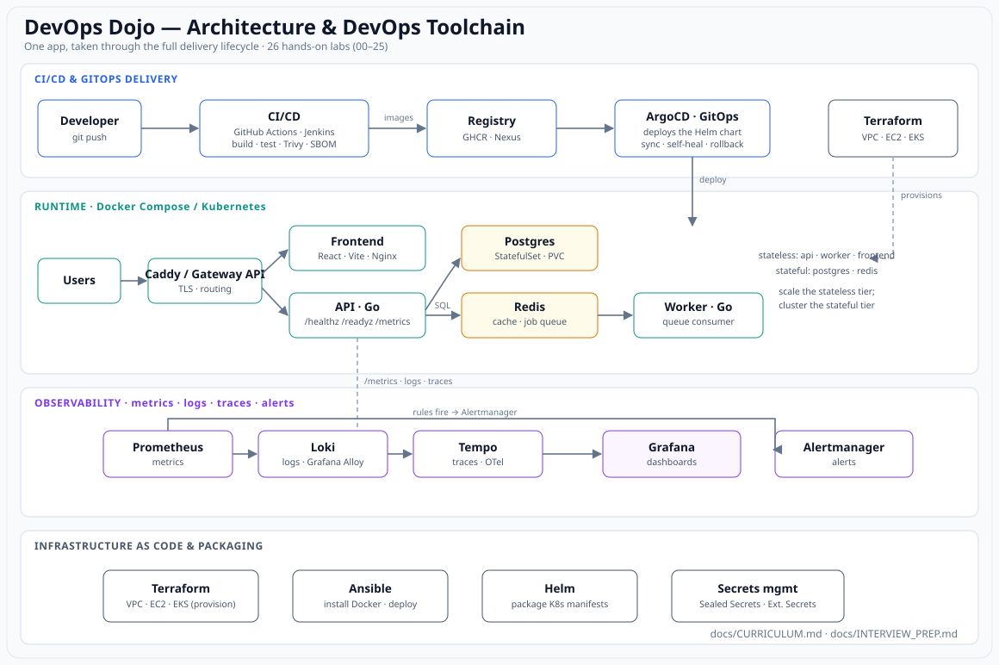

# DevOps Dojo 🥋

A **hands-on, step-by-step DevOps learning project**. You learn by building, running,
deploying, and operating a small but real web application — and the application you deploy
*is* the curriculum: a dashboard that shows the roadmap and tracks your progress.

> Replaces the old `DBC_to_C_code`-based learning path with a relatable, stateful 3‑tier
> app so that databases, monitoring, scaling, and queues are **real**, not bolted on.
> The full step-by-step teaching guide is
> [docs/DOCKER_LEARNING_PATH.md](docs/DOCKER_LEARNING_PATH.md); each concept links to a
> hands-on lab under [labs/](labs/).



> 🤖 **Second project — [ai-assistant/](ai-assistant/):** a local, private **RAG assistant**
> (LLMOps) that answers questions about these docs using a local LLM via **Ollama / LM Studio**,
> **Qdrant** vectors, grounding guardrails, metrics, an eval harness, and Compose/CI/K8s. It's
> the AI-infra differentiator on top of this DevOps foundation.

## What you build

| Tier | Tech | Why it's here |
|------|------|---------------|
| `frontend` | React + Vite + TypeScript | The dashboard UI |
| `api` | Go (`chi`, `pgx`) | REST API with real `/metrics`, `/healthz`, `/readyz`, tracing |
| `worker` | Go | Background jobs off a Redis queue (teaches scaling & queues) |
| `db` | PostgreSQL | Progress, notes, curriculum — teaches migrations & backups |
| `redis` | Redis | Cache + job queue |
| `caddy` | Caddy | Reverse proxy + automatic HTTPS (prod) |
| observability | Prometheus, Grafana, Loki, Promtail, Tempo, Alertmanager | metrics, logs, traces, alerts |

## Prerequisites

- Docker Desktop (Linux containers) + Docker Compose v2
- PowerShell (commands are written for it; bash equivalents are easy)
- Optional later: Node 20+, Go 1.23+ (only if you want to run app code outside Docker),
  `kubectl` + `kind`, `helm`, `terraform`, `ansible`, `k6`

New to the Linux side of containers? Read [docs/LINUX_FOR_CONTAINERS.md](docs/LINUX_FOR_CONTAINERS.md).

## Quick start (development)

From the **repo root**:

```powershell
copy .env.example .env
docker compose -f deploy/compose/compose.yaml -f deploy/compose/compose.dev.yaml up --build
```

Then open:

- Dashboard (Vite dev server): http://localhost:5173
- API health: http://localhost:8080/healthz
- API metrics: http://localhost:8080/metrics

Toggle a lab "complete" in the UI, reload the page, and confirm it persisted — that round
trip proves the **frontend → api → Postgres** path is working (Redis caches the read).

Stop everything:

```powershell
docker compose -f deploy/compose/compose.yaml -f deploy/compose/compose.dev.yaml down
```

Wipe the database volume for a clean start:

```powershell
docker compose -f deploy/compose/compose.yaml down -v
```

## How to use the labs

Work through `labs/00..26` in order, then pick up the Kubernetes deep-dive (`27..34`),
the operate-and-automate track (`35..42` — labs 37–38 can be done anytime after the
foundation), and the ecosystem-breadth track (`43..47`, TWN-inspired). Every lab follows
the same shape:

> **Concept (what & why) → What you'll do → Steps → How it works → Exercise → Checkpoint → Common failures → Maps to**

The **Checkpoint** is your pass/fail test for that concept. The full roadmap with status
lives in [docs/CURRICULUM.md](docs/CURRICULUM.md) and inside the running dashboard.

## Repo layout

```
app/api          Go API + worker (one image, two entrypoints)
app/frontend     React + Vite dashboard
db/migrations    golang-migrate SQL (schema + seeded curriculum)
deploy/compose   base + dev + prod + observability Compose files
deploy/caddy      Caddyfile (reverse proxy / HTTPS)
deploy/monitoring Prometheus, Grafana, Loki, Promtail, Tempo, Alertmanager, blackbox
deploy/k8s       Kubernetes manifests, Helm chart, kind config   (milestone 3)
deploy/terraform Terraform to provision a VPS/EC2               (milestone 2)
deploy/ansible   Ansible to configure + deploy                  (milestone 2)
deploy/load-test k6 load test                                   (milestone 3)
labs/            one folder per concept
docs/            curriculum + references
.github/workflows CI/CD                                          (milestone 2)
ai-assistant/    Second project: local/remote RAG assistant (LLMOps) — see its own README
```

## Build status

- ✅ **Milestone 1 — runnable foundation:** app, Compose (dev/prod), Postgres + migrations,
  Redis + worker, health checks, backup/restore, full observability stack, labs 00–12.
- ✅ **Milestone 2 — delivery & infrastructure:** GitHub Actions CI/CD (build/test/scan/push),
  Terraform (provision EC2), Ansible (configure + deploy), Nexus overlay, labs 13–17 —
  plus Jenkins as the self-hosted CI/CD alternative (lab 24).
- ✅ **Milestone 3 — cloud, scale, Kubernetes:** EC2 + HTTPS, security hardening, k6 load test,
  horizontal scaling, Kubernetes on kind + Helm chart, labs 18–23.
- ✅ **Capstone (lab 25):** DevOps Dojo on **AWS EKS** (Terraform) delivered by **GitOps
  (ArgoCD)** — the end-to-end, interview-ready deployment.
- ✅ **Production secrets (lab 26):** Sealed Secrets / External Secrets Operator — no plaintext
  in Git.
- ✅ **Kubernetes deep-dive (labs 27–34):** RBAC, NetworkPolicies (+Calico), Kyverno,
  cert-manager, KEDA, Argo Rollouts, Velero, kube-prometheus-stack — Platform/SRE, CKA/CKS.
- ✅ **Milestone 4 — operate, automate & prove it (labs 35–42):** incident drills + runbooks,
  multi-env promotion, Bash/Python automation, Git workflows, Terraform state/modules, AWS
  core services, supply-chain security, GitLab CI. **43 labs (00–42) complete.**
- ⬜ **Milestone 5 — ecosystem breadth & portability (labs 43–47):** Jenkins Shared Library +
  dynamic versioning, Ansible dynamic inventory + Terraform handoff, Boto3 ops automation,
  Helm library chart + Helmfile, and the same chart on **Azure AKS**
  (+ [cloud provider map](docs/CLOUD_PROVIDER_MAP.md)) — TWN-bootcamp-inspired additions.

> 🎯 **Aiming for a DevOps job?** The capstone is your interview centerpiece; see
> [docs/INTERVIEW_PREP.md](docs/INTERVIEW_PREP.md) for a full talk track (likely questions +
> project-grounded answers, troubleshooting scenarios, and a gap-closing study plan).
